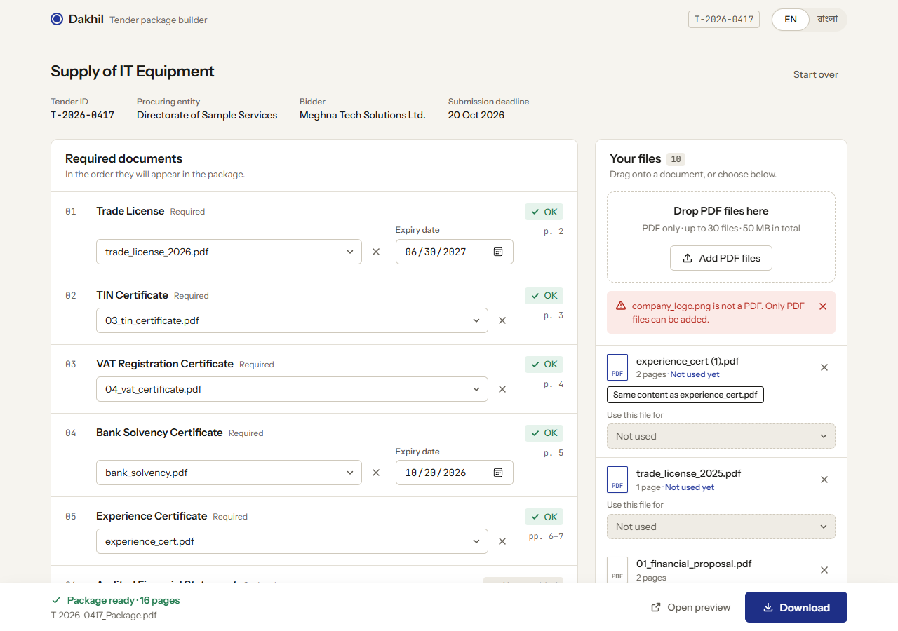
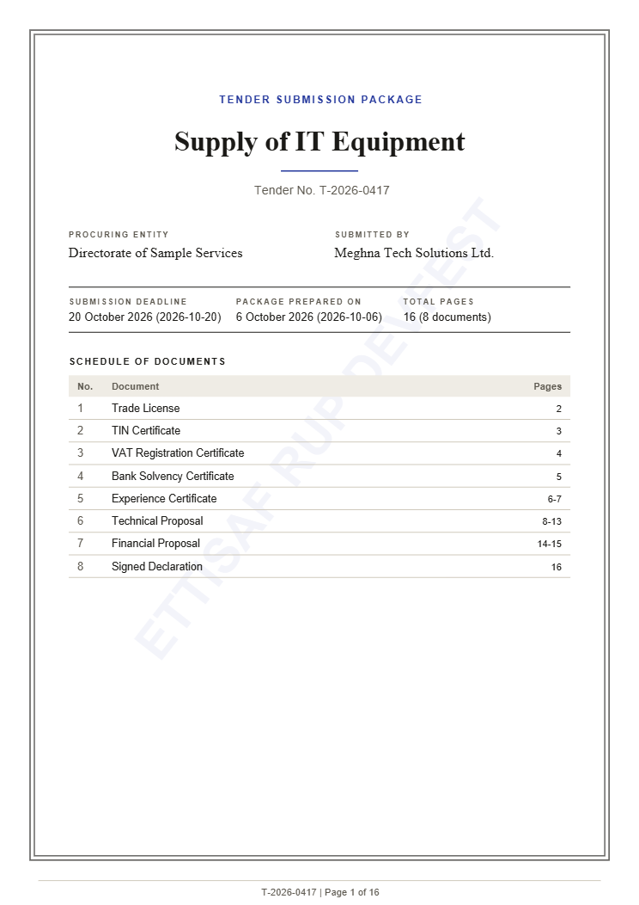
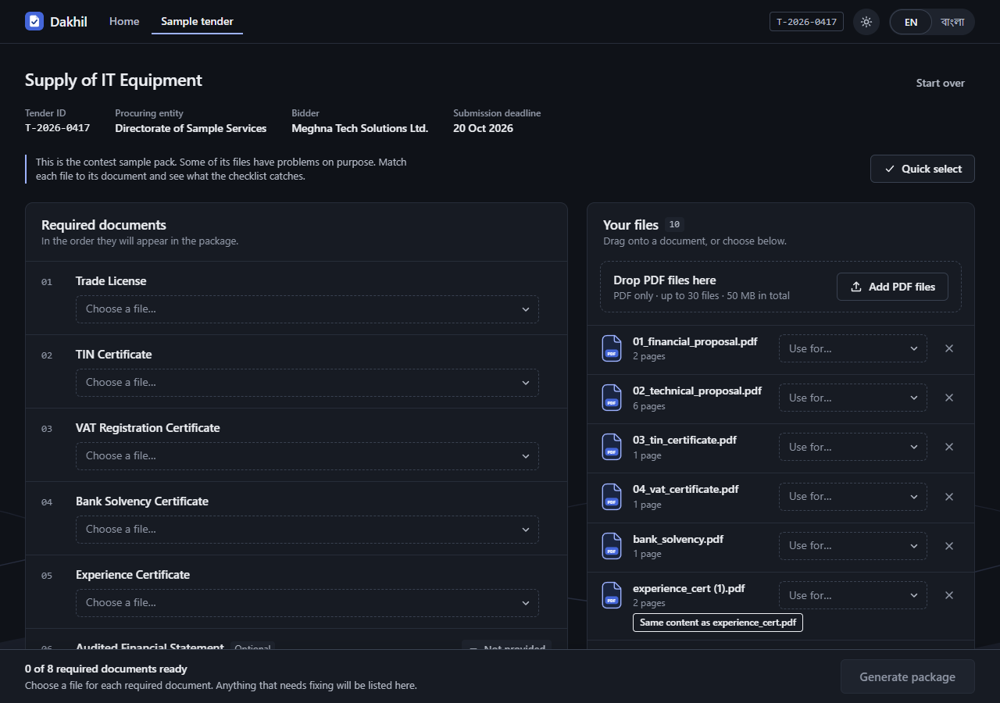

<p align="center">
  
</p>

<h1 align="center">Dakhil | দাখিল</h1>

<p align="center">
  <strong>Our Tender Document Package Builder</strong><br />
  Turn a folder of PDFs into one checked, ordered, page-numbered tender package, without a single file leaving your browser.
</p>

<p align="center">
  <a href="https://dakhil-ettisafxrup.netlify.app/"><strong>Open the live app</strong></a>
  &nbsp;·&nbsp;
  <a href="https://dakhil-ettisafxrup.netlify.app/sample">Try the sample tender</a>
  &nbsp;·&nbsp;
  <a href="output/T-2026-0417_Package.pdf">See a generated package</a>
</p>

<p align="center">
  
</p>

---

## About this entry

|                 |                                                                             |
| --------------- | --------------------------------------------------------------------------- |
| **Contest**     | AI DevFest 2026, Vibe Coding Competition                                    |
| **Participant** | Ettisaf Rup                                                                 |
| **Mail**        | mosharraf2407109@stud.kuet.ac.bd                                            |
| **Live URL**    | https://dakhil-ettisafxrup.netlify.app/                                     |
| **Stack**       | React, TypeScript, Vite, plain CSS, pdf-lib                                 |
| **Privacy**     | Frontend only. Every file is processed in the browser; nothing is uploaded. |

---

## The problem

A tender bid can be thrown out over one small mistake: a document that is missing, expired, duplicated or in the wrong order. Office staff usually catch these by eye, checking a requirements list against a folder of PDFs the day before the deadline.

## The solution

**Dakhil** ("submission" in Bangla) turns the tender's `requirements.json` into a live checklist.

1. **Open** the requirements file, or drop the whole tender folder.
2. **Match** each PDF to the document it satisfies. Every rule is checked as you go.
3. **Download** one ordered, page-numbered package, available only when nothing blocks it.

---

## Main features

All nine main tasks from the problem statement are complete.

| #   | Task          | How it works                                                                                                                                   |
| --- | ------------- | ---------------------------------------------------------------------------------------------------------------------------------------------- |
| 4.1 | Load the list | Opens `requirements.json`, shows tender details and documents sorted by `order`.                                                               |
| 4.2 | Upload files  | Many PDFs at once, with name and page count. Non-PDF files are rejected with a clear message. Any file can be removed.                         |
| 4.3 | Match files   | By dropdown on the document, dropdown on the file, or drag and drop. One file per document, one document per file. Change or undo at any time. |
| 4.4 | Expiry dates  | A date field appears for matched documents with `has_expiry`.                                                                                  |
| 4.5 | Live status   | Missing, Expiry date needed, Expired, Not provided or OK, updated on every change. Expiring on the deadline day counts as OK.                  |
| 4.6 | Duplicates    | Files with identical content (SHA-256) are marked, and cannot be matched to two different documents.                                           |
| 4.7 | Generate      | The button stays disabled while anything blocks, and lists each reason with a link to the row.                                                 |
| 4.8 | Download      | Saved as `<tender_id>_Package.pdf`.                                                                                                            |
| 4.9 | Two languages | The whole interface switches between English and Bangla; document names use `title_en` or `title_bn`.                                          |

### The generated package

<p align="center">
  
</p>

- **Cover page** in English, laid out as a formal submission: tender ID, title, procuring entity, bidder, deadline, date prepared, and a schedule of the included documents in order with their page ranges. It carries a faint "ETTISAF RUP DEVFEST" watermark.
- **Documents** in tender order, with all of their pages. Optional documents with no file are skipped.
- **Footer** `<tender_id> | Page X of Y` on every page. Each page is scaled slightly to open a blank band at the bottom, so the footer never covers content, including on rotated, cropped and very small pages.
- **Form fields** that were filled in are flattened, so their values stay visible.

### Beyond the brief

- **Clean URLs:** home (`/`), your tender (`/tender`) and a built-in sample tender (`/sample`).
- **Folder drop:** drop a whole tender folder on the home page and `requirements.json` loads together with the PDFs inside it.
- **Quick select:** on the sample page, one click fills every required document with its correct file and expiry date.
- **Light and dark themes:** switched from the top bar and remembered between visits. A first visit follows the system setting.
- **Protection against lost work:** opening a second tender over loaded files asks first, and the browser warns before a tab with loaded files is closed.
- **Responsive and accessible:** works down to 360px wide, with keyboard-accessible controls and a live page range on every checklist row.
- **Motion with restraint:** a typing headline, a cursor trail, a click burst and a drifting background, all switched off for anyone who asks for reduced motion.

<p align="center">
  
</p>

---

## Bonus features

- **Handle bad files safely:** damaged and password-protected PDFs get a clear message instead of a crash. The 30-file and 50 MB limits are enforced the same way.

No other bonus task is implemented.

---

## Known problems and limitations

### Not built

- No auto-match: every file is matched by hand. The sample page's Quick select uses a fixed answer key for that pack only.
- No index page, seal placement, checklist export or AI help.
- No in-app file preview or thumbnails, so a file with an unhelpful name must be opened outside the app to identify it. The finished package can be previewed in a new tab.

### Behaviour to be aware of

- Work is not saved. Refreshing the page clears the tender and files; only the language and theme choices are remembered.
- Removing a file has no undo.
- The expiry date field uses the browser's own date format.
- The PDF cover is English only. Characters outside Latin-1 in tender fields are printed as `?`.
- The "SAMPLE" watermark seen inside the sample documents is printed in the contest's own PDFs. The app copies document pages unchanged and does not alter it.
- The built-in sample page loads the pack's ten PDFs only. Its PNG logo is left out so the page does not open with an error; adding a non-PDF yourself still shows the rejection.
- Clean URLs need the host to serve `index.html` for unknown paths. `public/_redirects` does this on Netlify; other hosts need their own rule.

### How far it has been tested

- `npm test` runs 44 checks on the status rules, file handling and the generated PDF.
- Automated browser runs cover the full flow in both languages and both themes, at phone and desktop widths. They ran in headless Microsoft Edge (Chromium), not in Chrome itself.
- The password-protected check uses a hand-built encrypted file, not one saved by a real PDF tool.
- The Bangla text has not been reviewed by a second reader.

---

## Run it locally

Requires Node.js 18 or newer.

```bash
npm install
npm run dev        # development server
npm run build      # type-check and production build into dist/
npm run preview    # serve the production build
npm test           # rule and PDF checks
```

To try it, open the sample tender from the home page, or load `sample-pack/requirements.json` and the PDFs in `sample-pack/documents/`.

### Where things are

| Path                             | What it holds                                           |
| -------------------------------- | ------------------------------------------------------- |
| `src/lib/`                       | Status rules, file reading, routing and the PDF builder |
| `src/state/`                     | Project state, package generation and theme             |
| `src/components/`                | The interface                                           |
| `src/i18n/`                      | Every English and Bangla string                         |
| `tests/`                         | Unit checks                                             |
| `output/T-2026-0417_Package.pdf` | The package generated from the sample pack              |
| `screenshots/`                   | Screens, including the document statuses                |
| `public/brand/`                  | The logo as SVG and PNG                                 |

---

## AI tools used

- **Claude Code** (Anthropic), running Claude Opus 5.5, for planning, the design system, implementation, review and automated browser testing.

No API keys are used by the app, and none are stored in this repository.

## Most useful AI prompt

The opening prompt, which forced a plan before any code (excerpt):

> You are a senior product designer and frontend architect. I am participating in a frontend-only 90-minute vibe-coding competition. […] My goal is not to build the largest application. My goal is to create a small but exceptionally polished product that judges immediately understand and remember.
>
> First: 1. Identify the target user 2. Define the core problem 3. Define the core solution 4. Define the single WOW feature 5. Design the ideal 3-minute demo flow 6. List only the essential screens 7. Identify potential judge objections.
>
> Do NOT write code yet.

It produced the "checklist is the package" concept and exposed the traps hidden in the sample pack before a line was written.

---

<p align="center">
  AI Dev Fest 2026 · Vibe Coding Competition · Made by <a href="https://github.com/ettisafxrup">@ettisafxrup</a> · <a href="LICENSE">MIT License</a>
</p>
